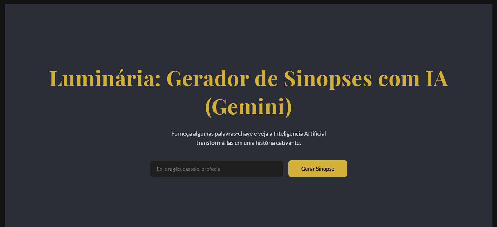

<p align="center">
  
</p>


# 📖 Luminaria: Gerador de Sinopses com IA 🤖

<br>

> ⭐ Se você gostou do projeto, deixe uma estrela no repositório!

<br>

*Dando vida a novas histórias com o poder da Inteligência Artificial do Google Gemini.*

<p align="center">
  
</p>

Bem-vindo ao **Luminaria**, um assistente de criação literária que transforma simples palavras-chave em sinopses de livros cativantes. Este projeto é uma aplicação full-stack que une a interatividade do React com a robustez do Node.js, tendo o Google Gemini como seu coração criativo.

A aplicação apresenta um design sofisticado e imersivo, o tema **"Escriba Digital"**, inspirado no universo da literatura clássica, com uma paleta de cores elegante e tipografia refinada para uma experiência de usuário única.

<br>


## 🎯 O Objetivo do Projeto

Este projeto foi desenvolvido como um exercício prático e uma demonstração de habilidades, com os seguintes objetivos em mente:

*   **🎓 Aplicar Conhecimentos:** Solidificar os conceitos de integração entre frontend e backend aprendidos no curso da **Digital Innovation One (DIO)**.
*   **🧠 Explorar Novas Fronteiras:** Ir além do currículo proposto, substituindo a API do ChatGPT pela poderosa e flexível **Google Gemini API**, a fim de explorar suas capacidades únicas de geração de texto.
*   **🔧 Construir uma Solução Completa:** Desenvolver uma aplicação full-stack funcional, desde a interface do usuário até a lógica do servidor e a comunicação segura com um serviço externo.
*   **🛡️ Dominar a Segurança de APIs:** Implementar a prática essencial de proteger chaves de API, garantindo que credenciais sensíveis nunca sejam expostas no lado do cliente.

<br>


## 💡 A Gênese do Projeto: Uma Jornada de Aprendizado

Este projeto nasceu como parte do desafio do curso **"Integrando o ChatGPT com Node e React"**, ministrado pelo excelente professor **Felipe Silva Aguiar** na plataforma **DIO**.

Inspirado pelo desafio, optei por explorar uma rota alternativa, utilizando o **Google AI Studio** e a API do **Gemini**. Essa decisão teve como objetivo aprofundar meus conhecimentos em diferentes modelos de linguagem e entender as nuances de suas integrações.

Curiosamente, o próprio **Gemini**, a IA no coração deste projeto, foi um parceiro de *pair programming* em diversas etapas, auxiliando na depuração de código, na criação desta documentação e na refatoração de componentes, demonstrando na prática o futuro da colaboração homem-máquina no desenvolvimento de software.

<br>


## ✨ Funcionalidades Principais

*   **✍️ Motor Criativo com Gemini:** Basta inserir algumas palavras-chave e a IA gera uma sinopse original e envolvente.
*   **✒️ Interface Elegante e Imersiva:** Uma UI polida com o tema "Escriba Digital", projetada para inspirar a criatividade e focar na experiência de escrita.
*   **🔒 Segurança em Primeiro Lugar:** A chave da API do Gemini é armazenada de forma segura no backend (Node.js), seguindo as melhores práticas de segurança para proteger suas credenciais.
*   **✨ Animações Sutis e Feedback Visual:** Indicadores de carregamento polidos e animações suaves que tornam a interação mais fluida e agradável.

<br>


## 🛠️ Arquitetura e Tecnologias

O projeto segue uma arquitetura cliente-servidor clássica, garantindo a separação de responsabilidades e a segurança.

**Fluxo de Dados:**
> `Usuário (Frontend React)` ➔ `Envia Requisição HTTP` ➔ `Nosso Backend (Node.js/Express)` ➔ `Chama a API do Gemini com a chave segura` ➔ `Retorna a Sinopse` ➔ `Exibe na Tela do Usuário`

| Categoria           | Tecnologia                                                                         |
| ------------------- | ---------------------------------------------------------------------------------- |
| **Frontend** (`/web`)   |   |
| **Backend** (`/server`) |    |
| **Inteligência Artificial** |  |

<br>


## 🚀 Guia de Instalação e Execução

Siga os passos abaixo para ter o **Luminaria** rodando em sua máquina local.

### Pré-requisitos

*   [Node.js](https://nodejs.org/en/) (versão 18 ou superior).
*   Um gerenciador de pacotes como `npm` ou `yarn`.
*   Uma chave de API válida do [Google Gemini](https://aistudio.google.com/app/apikey).

### 1. Preparação do Ambiente

Primeiro, clone este repositório para sua máquina:
```bash
git clone https://github.com/MarcosWinther/project-react-node-gemini-AI-assistant-to-generate-synopsis
cd project-react-node-gemini-AI-assistant-to-generate-synopsis
```

### 2. Configurando o Backend (`server`)

1.  **Navegue para a pasta do servidor:**
    ```bash
    cd server
    ```

2.  **Crie o arquivo de variáveis de ambiente:**
    Crie um arquivo chamado `.env` nesta pasta.

3.  **Adicione sua chave da API:**
    Cole o seguinte conteúdo no arquivo `.env`, substituindo `SUA_API_KEY_VEM_AQUI` pela sua chave real.
    ```
    GEMINI_API_KEY="SUA_API_KEY_VEM_AQUI"
    PORT=5000
    ```

4.  **Instale as dependências e inicie o servidor:**
    ```bash
    npm install
    npm start
    ```
    ✅ Seu backend agora está rodando em `http://localhost:5000`. Deixe este terminal aberto.

### 3. Configurando o Frontend (`web`)

1.  **Abra um novo terminal.**

2.  **Navegue para a pasta do frontend (a partir da raiz do projeto):**
    ```bash
    cd web
    ```

3.  **Instale as dependências e inicie a aplicação:**
    ```bash
    npm install
    npm start
    ```
    🎉 Sua aplicação será aberta automaticamente no navegador em `http://localhost:3000`.

<br>


## 🤝 Agradecimentos

Um agradecimento especial ao professor **[Felipe Silva Aguiar](https://www.linkedin.com/in/felipeaguiar-exe/)** e à **[DIO](https://www.dio.me)** pelo curso de alta qualidade, que serviu como catalisador para a criação e exploração deste projeto.

<br>


## 👨‍💻 Expert

<p>
    
    <p>&nbsp&nbsp&nbspMarcos Winther<br>
    &nbsp&nbsp&nbsp
    <a href="https://github.com/MarcosWinther">
    GitHub</a>&nbsp;|&nbsp;
    <a href="https://www.linkedin.com/in/marcoswinthersilva/">LinkedIn</a>
    </p>
</p>
<br/><br/>

---

⌨️ com 💜 por [Marcos Winther](https://github.com/MarcosWinther)
